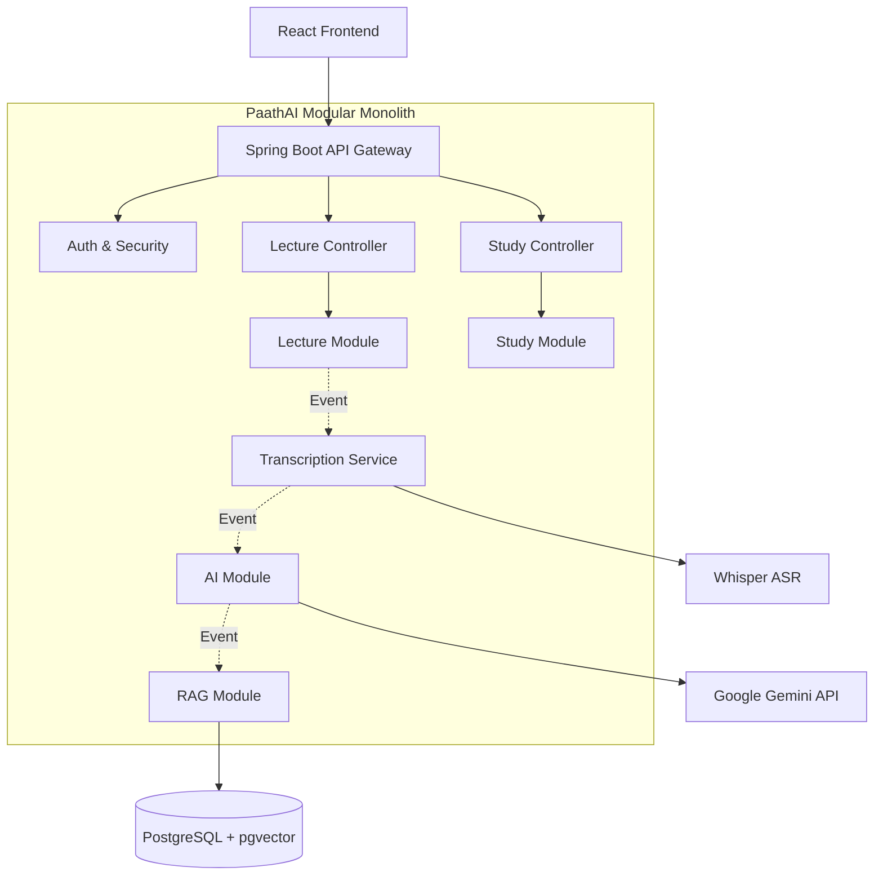
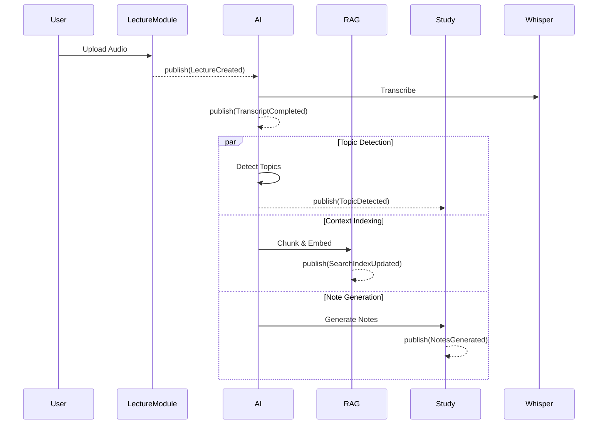
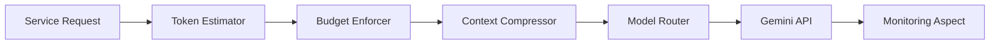

<div align="center">
  
  
  <h1>PaathAI</h1>
  <h3>AI-Powered Syllabus Intelligence Platform</h3>

  <p>
    Transform lectures into structured academic knowledge through transcription, syllabus mapping, semantic search, knowledge organization, and personalized learning intelligence.
  </p>

  <div>
    
    
    
  </div>
  <br/>
  <div>
    
    
    
    
  </div>
</div>

---

## 👁️ Vision

**Information overload is paralyzing modern education.** Students accumulate gigabytes of raw lecture audio and unorganized notes, resulting in fragmented learning paths and cognitive overload when preparing for exams.

**PaathAI exists to build a bridge between raw academic content and structured knowledge.**

Unlike generic AI note-taking tools, PaathAI understands the **academic hierarchy**. By parsing the syllabus and actively tracking the learning progression, PaathAI converts raw lecture audio into highly contextual, searchable, and syllabus-aware structured data.

### Problems Solved:
- 📉 **Fragmented Notes:** Replaces scattered documents with a cohesive knowledge base.
- 🗺️ **Missing Learning Paths:** Maps content directly to syllabus units and topics.
- 🔍 **Unstructured Content:** Turns opaque audio files into searchable, semantic vector representations.
- 💸 **Unpredictable AI Costs:** Enforces rigorous token tracking and LLM budget governance.

---

## ✨ Key Features

### 🎙️ Lecture Intelligence
- **Asynchronous Transcription:** Seamless conversion of audio to text using Whisper ASR.
- **Smart Chunking:** Intelligently splits transcripts respecting semantic boundaries.
- **Topic Extraction:** Automatically detects topics and subtopics discussed in lectures.

### 📚 Syllabus Intelligence
- **Hierarchical Parsing:** Extracts Subject → Unit → Topic structures from syllabus PDFs.
- **Contextual Anchoring:** Maps transcribed lecture chunks directly to syllabus expectations.
- **Coverage Tracking (Future):** Identifies gaps between what was taught and the syllabus.

### 🔍 Search & Retrieval
- **Hybrid RAG Pipeline:** Combines vector similarity (pgvector) with keyword search.
- **Syllabus-Grounded Answers:** Answers queries using *your* course materials, avoiding LLM hallucinations.
- **Source Attribution:** Clearly cites the lecture timestamp and notes used for generation.

### 🧠 AI Infrastructure
- **Model Routing:** Routes requests dynamically (Gemini Flash for speed, Gemini Pro for reasoning).
- **Versioned Prompt Registry:** Decouples prompts from code, allowing dynamic iteration and A/B testing.
- **Context Compression:** Intelligently truncates or summarizes payloads to fit token budgets.

### 📊 Monitoring & Cost Control
- **Cost Gateway:** Every LLM call is intercepted for token estimation and budget validation.
- **Per-Student Quotas:** Prevents runaway costs via daily limits.
- **Observability:** Tracks latency, model usage, and success rates for every prompt.

---

## 🏛️ System Architecture

PaathAI is engineered as a **Modular Monolith** with **Event-Driven** internal communication. This ensures high cohesion, low coupling, and an easy migration path to microservices when scaling demands it.

### High-Level Architecture



### Event Flow (Fan-Out Pattern)



---

## 📦 Module Structure

PaathAI is strictly compartmentalized. Inter-module communication is achieved via domain events and well-defined Java interfaces, enforced by ArchUnit tests.

| Module | Responsibility | Key Components |
|--------|----------------|----------------|
| `paathai-app` | Application entry point, config, security, Flyway migrations | `PaathAIApplication`, `SecurityConfig` |
| `paathai-common` | Shared domain events, exceptions, DTOs | `LectureCreated`, `TokenBudgetExceededException` |
| `paathai-ai` | Cost governance, prompt management, model routing | `AICostController`, `PromptRegistry` |
| `paathai-rag` | Chunking, embedding generation, vector search, context assembly | `EmbeddingStore`, `ContextCompressor` |
| `paathai-syllabus` | PDF/JSON parsing, syllabus hierarchy extraction | `SyllabusParser` |
| `paathai-lecture` | Audio upload, Whisper transcription integration | `TranscriptionService` |
| `paathai-study` | Generation of study materials (notes, flashcards, quizzes) | `NotesGenerationService` |
| `paathai-monitoring` | Token tracking, latency logs, AI cost observability | `LlmRequestLog` |

---

## 🛠️ Technology Stack

| Technology | Purpose |
|------------|---------|
| **Java 21** | Core backend language; leverages virtual threads and modern language features. |
| **Spring Boot 3.3** | Web framework, dependency injection, and data access (JPA/Hibernate). |
| **PostgreSQL 16** | Primary relational database; single source of truth. |
| **pgvector** | Vector extension for PostgreSQL to store and query embeddings. |
| **Google Gemini** | Primary LLM engine for reasoning, structuring, and summarization. |
| **OpenAI Whisper** | High-accuracy asynchronous audio transcription. |
| **Flyway** | Deterministic database schema migrations and version control. |
| **Docker Compose** | Local environment orchestration (Database + ASR). |

---

## 📂 Project Structure

```text
PaathAI/
├── .mvn/wrapper/                  # Maven wrapper
├── paathai-ai/                    # AI Governance & Prompt Engine
├── paathai-app/                   # Bootloader & Config
│   └── src/main/resources/
│       ├── db/migration/          # Flyway SQL migrations
│       ├── application.yml        # Base configuration
│       └── application-dev.yml    # Docker compose profile
├── paathai-common/                # Shared Contracts & Events
├── paathai-lecture/               # Ingestion & Transcription
├── paathai-monitoring/            # Observability & Cost Logs
├── paathai-rag/                   # Vector Search & Context
├── paathai-study/                 # Output Generation
├── paathai-syllabus/              # Hierarchy Extraction
├── prompts/                       # Versioned Markdown Prompts
├── docker-compose.yml             # Local infrastructure definition
└── pom.xml                        # Multi-module parent POM
```

---

## 🗺️ MVP Roadmap

### Phase 1: The MVP (Current Focus)
- [x] Project Scaffolding & Architecture setup
- [x] Database Schema & Flyway migrations
- [x] AI Cost Governance Pipeline
- [ ] JWT Authentication & Authorization
- [ ] Syllabus Ingestion (PDF -> Hierarchy)
- [ ] Lecture Upload & Transcription
- [ ] Basic RAG (Notes Generation & Search)

### Phase 2: Knowledge Intelligence
- [ ] Multi-Source Knowledge Graph (Neo4j)
- [ ] AI Flashcard Generation
- [ ] AI Quiz Generation
- [ ] Analytics Dashboard

### Phase 3: Advanced Ecosystem
- [ ] Roadmap Engine (Personalized learning paths)
- [ ] Coverage Engine (Gap analysis)
- [ ] Real-time Interactive AI Tutor

---

## 🤖 AI Architecture & Cost Governance

PaathAI treats LLM calls as expensive, untrusted operations. We employ a rigorous **AI Cost Gateway** pattern.

### The Pipeline


1. **Token Estimation:** Predicts payload cost before the HTTP call.
2. **Budget Enforcement:** Rejects requests if a student's daily quota is exhausted.
3. **Context Compression:** Truncates or summarizes context if it breaches the hard limit for the requested feature.
4. **Model Routing:** Selects `Gemini Flash` for simple parsing tasks and `Gemini Pro` for complex reasoning tasks.
5. **Prompt Registry:** Loads prompt templates directly from the filesystem (e.g., `prompts/topic_detection/v1.md`), allowing live updates without code recompilation.

---

## 🗄️ Database Design

PaathAI uses a single, robust PostgreSQL database to simplify operational overhead while fully supporting vector operations.

### Key Entities
- **Syllabus Hierarchy:** `syllabi` → `subjects` → `units` → `syllabus_topics`
- **Lectures:** `lectures` → `transcripts` → `transcript_chunks`
- **Outputs:** `notes`
- **Observability:** `llm_request_logs`, `token_usage`, `processing_failures`

*All searchable entities contain a `vector(768)` embedding column indexed via `IVFFlat` for rapid semantic similarity lookups.*

---

## 🚀 Local Development

### Prerequisites
- JDK 21
- Docker & Docker Compose
- Google Gemini API Key

### 1. Clone & Setup
```bash
git clone https://github.com/sudeshsudhii/PaathAI.git
cd PaathAI
cp .env.example .env
# Edit .env and add your GEMINI_API_KEY
```

### 2. Start Infrastructure
```bash
docker compose up -d
```
*This spins up PostgreSQL (with pgvector) on port 5432 and the Whisper ASR service on port 9000.*

### 3. Run the Application
```bash
./mvnw spring-boot:run -pl paathai-app -Dspring-boot.run.profiles=dev
```
*The API will be available at `http://localhost:8080`.*

---

## 🔄 Development Workflow

- **Branching Strategy:** Feature branching off `main`.
- **Commit Convention:** Conventional Commits (`feat:`, `fix:`, `chore:`).
- **Architectural Rules:** Enforced by ArchUnit tests (e.g., cross-module calls must go through interfaces, services cannot contain hardcoded prompts).

---

## 🧪 Testing Strategy

- **Unit Tests:** High coverage for core logic (Token Estimation, Chunking Strategies).
- **Integration Tests:** Verifying RAG retrieval accuracy and Database queries using Testcontainers.
- **Event Tests:** Verifying asynchronous fan-out behavior.
- **Architecture Tests:** Guarding module boundaries and enforcing design constraints.

---

## 🔒 Security

- **Authentication:** Stateless JWT tokens.
- **Authorization:** Role-Based Access Control (Student, Teacher, Admin).
- **Data Isolation:** All queries are strictly scoped to the authenticated user's `student_id` or `course_id`.

---

## 🤝 Contributing

We welcome contributions! Please see our [CONTRIBUTING.md](CONTRIBUTING.md) for detailed guidelines on how to submit issues, feature requests, and pull requests.

1. Fork the repository.
2. Create a feature branch (`git checkout -b feature/amazing-feature`).
3. Commit your changes (`git commit -m 'feat: add amazing feature'`).
4. Push to the branch (`git push origin feature/amazing-feature`).
5. Open a Pull Request.

---

## 📄 License

This project is licensed under the MIT License - see the [LICENSE](LICENSE) file for details.

---
<div align="center">
  <sub>Built with ❤️ for the future of education.</sub>
</div>
